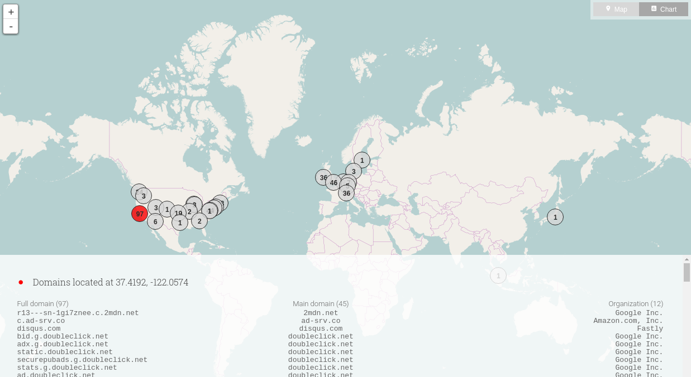

# VR
This is a visualization app built by James Nolan as part of the T4WT web privacy analysis platform, a project of [NGSENS](https://www.ngsens.com) and [HEIG-VD](https://www.heig-vd.ch). It is built using React.js, Leaflet and D3.js.

# Demo
A demo is available [here](https://t4wt.ngsens.com/demo).

It lists trackers found on all links listed on the [Data Is Beautiful](https://www.reddit.com/r/dataisbeautiful/) subreddit on September 7, 2016.

It is a static version and some functionnalities are disabled (authentification required).

# Usage
You can build the package from sources, using:

1. npm install
2. npm run dev (development environment)
3. npm run dev:watch (same, rebuilds when a file is edited)
4. npm run prod (production environement, minified)